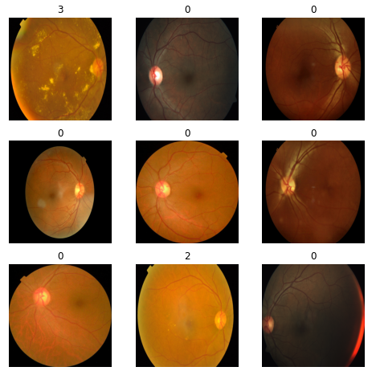
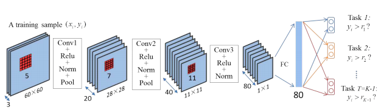
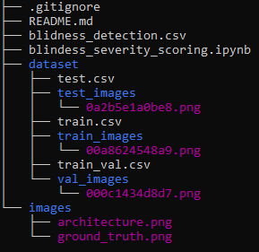

# Blindness severity scoring using ordinal cnn
The Ordinal regression based CNN proposed by Zhenxing Niu et. al, 2016 is implemented and used for the APTOS blindness detection, 2019 kaggle challenge (https://www.kaggle.com/c/aptos2019-blindness-detection)

## Dataset information

The dataset contains a large set of retina images taken using fundus photography under a variety of imaging conditions. A clinician has rated each image for the severity of diabetic retinopathy on a scale of 0 to 4:

0 - No DR

1 - Mild

2 - Moderate

3 - Severe

4 - Proliferative DR

Like any real-world data set, the dataset contains noise in both the images and labels. Images may contain artifacts, be out of focus, underexposed, or overexposed. The images were gathered from multiple clinics using a variety of cameras over an extended period of time, which
introduces further variation.

An illustration of few of the images in the dataset along with their labels is shown below:

## Ordinal Regression CNN

Since the classes are on an ordinal scale, both classification as well as regression based loss functions can be used as done by most of the participants in the challenge. However, there is a third alternative method called the Ordinal regression CNN proposed by Nui et al. 2016. This method splits the final layer of the CNN outputting K classes (5 in our case) into K-1 (4 in our case) binary sub-tasks and solves each binary sub task in parallel. 

The architecture of the OR-CNN model is shown below:

## Training and inference

The folder structure of this repository is shown below:

The 'dataset' folder contains the original dataset with seperate sub-folders 'train_images' and 'test_images' and corresponding csv files 'train.csv' with annotation scores and 'test.csv' without annotation scores. 

The 'blindness_severity_scoring.ipynb' notebook is used to first split the train dataset into train and val dataset sub-folders while creating an additional csv file named 'train_val.csv' that contains the scores and the splits. On a successful split, the further code can be run for training the model.

## References

@INPROCEEDINGS{7780901,
  author={Niu, Zhenxing and Zhou, Mo and Wang, Le and Gao, Xinbo and Hua, Gang},
  booktitle={2016 IEEE Conference on Computer Vision and Pattern Recognition (CVPR)}, 
  title={Ordinal Regression with Multiple Output CNN for Age Estimation}, 
  year={2016},
  volume={},
  number={},
  pages={4920-4928},
  doi={10.1109/CVPR.2016.532}}

  

